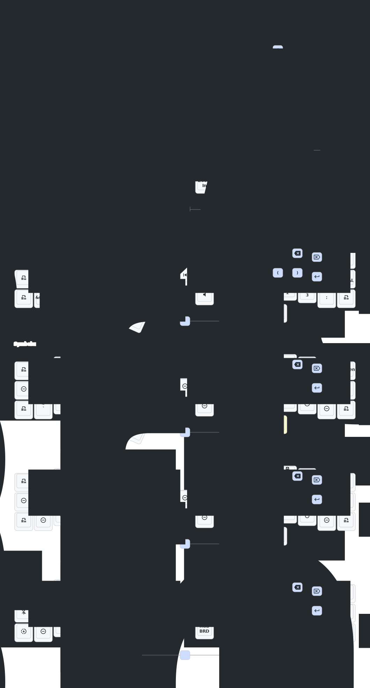

# Jon's Eyelash Corne ZMK Configurations

## My Eyelash Corne Build
- Left: 3x6
- Right: 3x6
- 3 thumb keys each side
- Joystick on the right hand side

## Highlights
- [sunaku's Enthium v12 Layout](https://github.com/sunaku/enthium)
- Designed for typing on MacOS
- Heavily based on [urob's zmk-config](https://github.com/urob/zmk-config)
  - [urob's "Timeless" homerow mods](https://github.com/urob/zmk-config/tree/main?tab=readme-ov-file#timeless-homerow-mods)
  - Auto-toggle off numbers and navigation layers
  - Shift thumb as Sticky-shift/Capsword/Shift
    - I realized the Magic key is not for me yet, and it also intefere with my CamelCase typing. Probably I missed something here.
  - Shifted actions that make sense: , ↦ ;, . ↦ : and ? ↦ !
  - Simpler Devicetree syntax using helper macros from zmk-helpers
- Tri-state swapper for windows swapping with up/down/left/right arrow keys on the NAV layer
- One hand operations on the left side for right hand mouse usage
- Nice!View Customization
  - Left: [kevinpastor's nice-view-elemental](https://github.com/kevinpastor/nice-view-elemental)
  - Right: [GPeye's hammerbeam-slideshow](https://github.com/GPeye/hammerbeam-slideshow)

## Keymap Diagram

